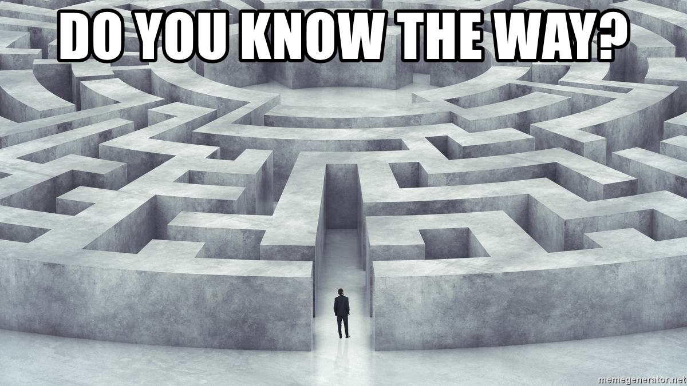
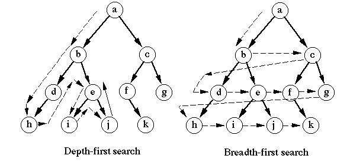

<h1>
In The Name Of ALLAH
</h1>
<h2>
Advanced Programming - Midterm Project
</h2>
<h2>
Dr.Amir Jahanshahi
</h2>
<h3>
Deadline: Thursday, 6 Khordad - 23:00

  
# Introduction

Danial has been challenged by his friend Dariush to solve a maze for a cup of coffee! First, he thought it would be an easy challenge and accepted it. But, it wasn't long since he understood what he has done! Since, he is an AP student this term, he has decided to code in the greate language of C++ to both prepare for the midterm and win the coffee. Help him!

# Algorithms

The algorithms to select each action are DFS (DLS) and BFS (BLS). (use google and youtube for details of the algorithms!)

# How To Play

Your program should have a good interface to communicate with the user. It must be able to generate random mazes and display them in beautiful ways. The user must choose the dimensions of the maze. Then it must find a way to get out of the maze using both algorithms (DFS and BFS). So in brief your program should

  1. Generating a random maze of desired dimensions (chosen by user).

  2. Get the algorithm to solve the maze from user (DFS of BFS).

  3. Show the steps in a beautiful way.
   
In displaying the maze and the steps, do the best you can to display it beautifully. The more beautiful your program, the more grade you get!

# Bonus Points

1.  Implementing the search algorithm with Bidirectional Search method will have extra points.
2.  And of course the more beautiful your UI, the better your grade! (you can use ANSI Codes to have a colorful output!)

# Notes
1.  Each student must create a github repository with his/her name for this project. You must have meaningful **commits** during your progress. These commits would be checked and have direct effect in your grade. For the sake of security :) please don't share your repo with other students!

2. In the end, each student must have a report file in pdf format and a presentation file in powerpoint. We would have a session and some random guys would present their work.
